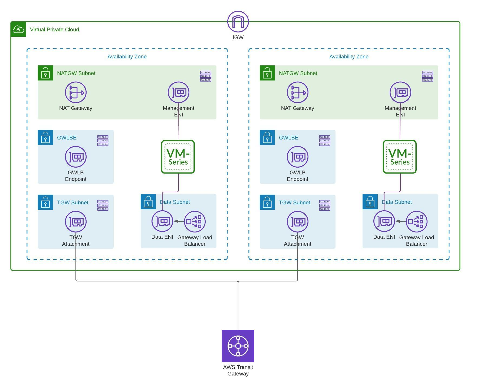

# Palo Alto Networks & AWS Gateway Load Balancer Deployment

## Security VPC Deployment

### Overview

This Cloud Formation Template (`SecurityVPC.yaml`) deploys the components needed to deploy Palo Alto Networks VM-Series Firewalls with the AWS Gateway Load Balancer in 2 Availability Zones (A & B).

#### Prerequisites

The following items are required prior to deployment of this template:
- **Non-Overlapping IP CIDR Block (/25)** - This will provide an IP addressing scheme for the VPC and the Subnets (8x /28 Subnets)


- **AMI of Palo Alto Networks VM-Series v10.0.2 or above** - This will allow you to deploy Gateway Load Balancer compatible Palo Alto Networks VM-Series firewalls.

  To obtain the AMI ID for the Bring Your Own License (BYOL) VM-Series in the "us-west-2" region you can run this command:
  ```
  aws ec2 describe-images --filters "Name=name,Values=PA-VM-AWS-10.0*" "Name=product-code,Values=6njl1pau431dv1qxipg63mvah" --region us-west-2 --query "Images[*].{Name:Name,AMI:ImageId,State:State}" --output table
  ```

  To obtain the AMI ID for other Licenses such as Bundle 1, 2, or BYOL you can get change the `"Name=product-code,Values=6njl1pau431dv1qxipg63mvah"` section with the appropriate product code from [here](https://docs.paloaltonetworks.com/vm-series/10-0/vm-series-deployment/set-up-the-vm-series-firewall-on-aws/deploy-the-vm-series-firewall-on-aws/obtain-the-ami/get-amazon-machine-image-ids.html) (see step 2).

  To obtain the AMI ID for other regions change the region after the `--region` in the command line.


- **EC2 Key Pair** - For authentication to Palo ALto Networks VM-Series firewalls.
  - To connect to the Palo Alto Networks VM-Series after deployment use  ```ssh admin@1.2.3.4 -i ec2keypair.pem``` substituting 1.2.3.4 for the correct Elastic IP or Private IP of the instance you want to connect to.


- **Remote Management IP CIDR** - A IP CIDR to be allowed access to the Palo Alto Networks VM-Series Management interface. To open access to all networks us `0.0.0.0/0`

The following aspects of this template are optional:
- **Bootstrap Configuration** - You have 3 options for configuration:

  1. You can provide a configuration file to allow them to start with this initial configuration and licensing applied. To deploy an existing configuration create an S3 Bucket with the appropriate files and folder structure, more details can be found here: https://docs.paloaltonetworks.com/vm-series/10-0/vm-series-deployment/bootstrap-the-vm-series-firewall/bootstrap-the-vm-series-firewall-in-aws.html. You need to enter the S3 Bucket name in the "AWS S3 Bucket Name containing the VM-Series Bootstrap Information" field in the CFT Template. There is a sample configuration in the `bootstrap/config` folder.

  2. You can manually configure the Palo Alto Networks VM-Series firewalls, by leaving the "AWS S3 Bucket Name containing the VM-Series Bootstrap Information" field in the template empty. This will do only the very basics of configuration and leave everything else to be configured.

  3. Modify the `user_data` sections of the EC2 instances in the supplied YAML CloudFormation template to allow for "Basic Bootstrap" configuration of the VM-Series. More details can be found here: https://docs.paloaltonetworks.com/vm-series/10-0/vm-series-deployment/bootstrap-the-vm-series-firewall/choose-a-bootstrap-method.html#idf6412176-e973-488e-9d7a-c568fe1e33a9_id3433e9c0-a589-40d5-b0bd-4bc42234aa0f

- **Transit Gateway Attachment** - You can choose to attach this VPC to an existing Transit Gateway and configure the Routing Needed to connect back to your existing resources. If you chose not to do this you will need an additional configuration later, or you can re-run this template specifying the Transit Gateway ID. This configuration only creates a Transit Gateway Attachment, no other changes to the Transit Gateway are made. To use this attachment for **East/West**, or **Outbound** traffic flow security, you will need to adjust the Transit Gateway Routing.

#### Diagram



### Deployment Steps

The easiest way to deploy this Cloud Formation Template (CFT) by using the AWS Console.

To deploy from the CLI you can use the AWS CLI, change the stack name and parameters as needed:

```
aws cloudformation deploy --template-file SecurityVPC.yaml --stack-name SecurityVPC --capabilities "CAPABILITY_IAM" --parameter-overrides "VMSeriesAMI=ami-06cb3ae59e4c46288" "EC2KeyPair=eu-west-1" "VmseriesBootstrapS3BucketName=" "TGWID="
```


### Notes:

#### USING BOOTSTRAP.XML

*If you are using an S3 Bucket to Bootstrap the firewalls with the provided `bootstrap.xml` file you can use the following username (`admin`) and password (`Pal0Alto!`) to login to the GUI Interface over HTTPS from your browser.*

#### :exclamation: APPLIANCE MODE ON TGW ATTACHMENT

*You will need to enable Appliance Mode on the TGW Attachment after deployment manually using the CLI as this is not supported in CloudFormation today. 
Use this command substituting the attachment ID and region for your values:*

You will need to ensure you AWS CLI is on version 2.1.15 or above, to check this run the following command:

```
aws --version
```

Once confirmed you can then run this command to set appliance mode on the Transit Gateway (TGW) attachment:

```
aws ec2 modify-transit-gateway-vpc-attachment --options "ApplianceModeSupport=enable" --transit-gateway-attachment-id tgw-attach-000000 --region eu-west-1
```


#### :exclamation: DO NOT TAG USING CLOUDFORMATION TAGS

*The Gateway Load Balancer does not currently support Tagging of resources, if you include a Tag when deploying the Cloud Formation Template the deployment will fail.*